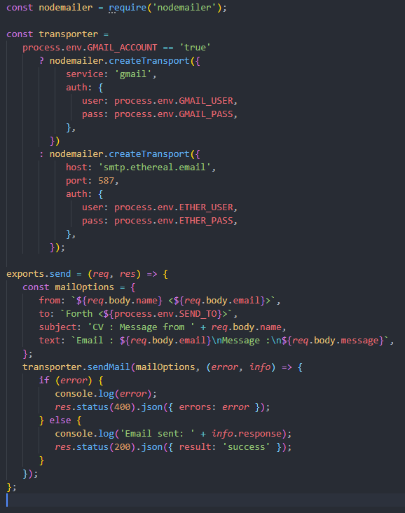
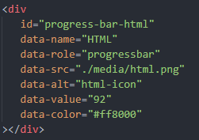
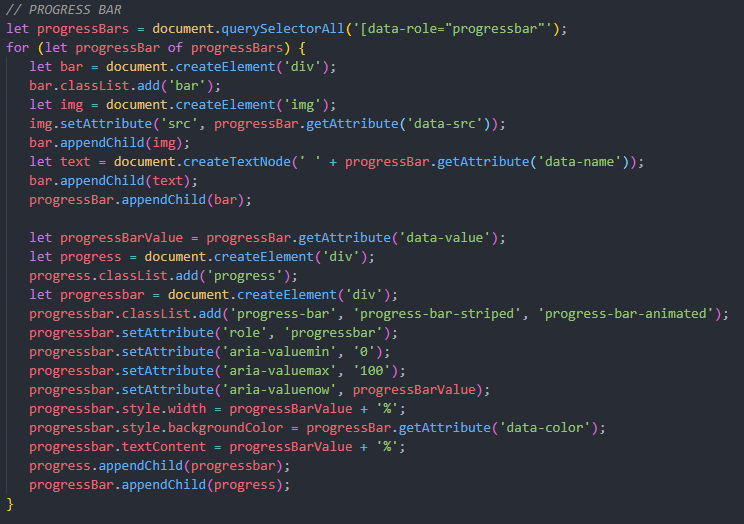

# Introduction

Ce projet CSS fait référence à la vidéo : [Coder son CV - Projet HTML + CSS + Javascript](https://www.youtube.com/watch?v=uPlb37rmauY). 

# Intérêts du projet

Ce projet utilise des règles CSS que j'utilise rarement. Sachant que le CSS est une part importante du Frontend, c'est pourquoi j'ai décidé de faire ce projet.

# Problèmes rencontrés

Pas de réels problèmes rencontrés à part des soucis de responsivité et un manque de lisité par endroits.

Toutefois ce CV dispose d'un formulaire pour la prise de contact. Dans la vidéo, l'envoi du mail se faire à l'aide d'un bout de code en php. N'ayant pas de serveur online et n'ayant pas réussi à configuration Wamp pour l'envoi de mail en local, j'ai pris la décision de faire cela autrement.

## Envoi des mails à l'aide de Sendmail

J'ai mis en place un serveur backend avec pour seul objectif l'envoi de mails à la validation du formulaire.

# Améliorations apportées au projet

Le première des améliorations apportées a été de corriger les problèmes de responsivités rencontrés et ajouter des text-shadow pour rendre plus lisible certains textes.

J'ai aussi amélioré le système des progressbar qui était fait entièrement en HTML/CSS, afin de faire celà à l'aide d'un script.

Le script récupère tous les éléments ayant un ``data-role="progressbar"`` afin de générer le code html nécessaire à l'aide des balises data de l'élément.

# Ce que m'a apporté ce projet

## AOS - Animate On Scroll

Ce CV utilise une librairie ([disponible ici](https://michalsnik.github.io/aos/)) qui ajoute facilement des effets visuels sur des div. Elle permet aussi d'afficher des éléments après un certain délai. Une librairie simple et efficace comme on les aime.

## CSS - Une navbar dynamique

La navbar se masque lorsque l'on déjà dans la page et s'affiche lorsque l'on remonte. Rien de bien compliqué, mais j'ai bien aimé l'idée. A réutiliser !

## JS - Typed

Typed est une librairie ([disponible ici](https://mattboldt.com/demos/typed-js/)) qui affiche du texte comme si on était en train de le saisir. Facile à configurer pour un effet instantané.

## CSS

Que ce soit le css pour les progressbar, les blocks languages et formations (avec des formes atypiques), parcours (avec une flèche centrale entre les éléments), portfolio (hover sur les images qui joue avec border et ::before et ::after) et enfin l'effet de recto-verso des hoobies. Pas mal de possibilités que je n'avais jamais utilisé. 

## Résumé

Pour résumer, même si le projet n'était qu'en HTML et CSS avec une touche de Javascript, ce projet m'a pas mal appris et apporté, et m'a permis d'utiliser de nouvelles librairies qui peuvent s'avérer utiles en fonction des situations.

# Screenshots du résultat

